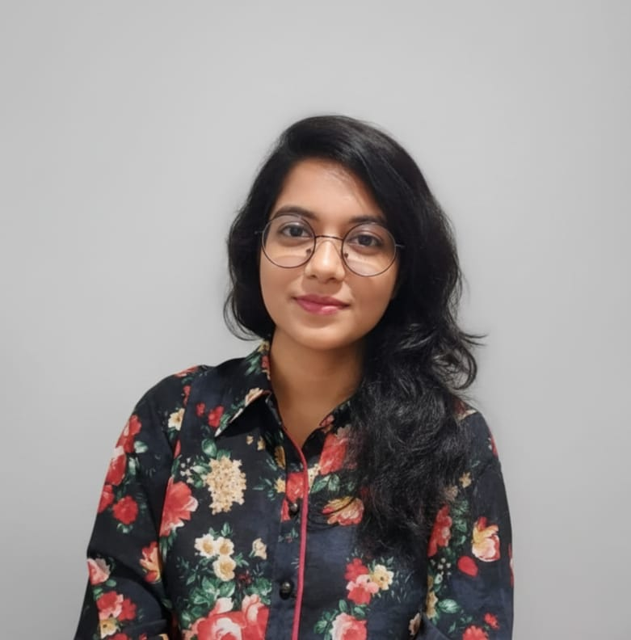

<html>
<head>
    <meta charset="UTF-8">
    <title>Meherab Mustafa - Portfolio</title>

    <link rel="stylesheet" href="https://cdnjs.cloudflare.com/ajax/libs/font-awesome/6.5.0/css/all.min.css">

    
</head>

<body>

    <!-- Header Section -->
    <h1>HI THERE!</h1>
    
    
I’m Meherab Mustafa

    
Bioscience Student & Researcher

    <!-- Icons -->
    

        <a href="mailto:meherabmustafa01@gmail.com" target="_blank">
            <i class="fa-solid fa-envelope"></i>
        </a>
        <a href="
http://www.linkedin.com/in/meherab-mustafa-424a14295" target="_blank">
            <i class="fa-brands fa-linkedin"></i>
        </a>
    

    <!-- Download CV Icon -->
    

        <a href="CV(Meherab Mustafa).pdf" download class="cv-button" title="Download CV">
            <i class="fa-solid fa-file-arrow-down"></i>
        </a>
    

    <!-- About Me -->
    <h2>About Me</h2>
    

        I have an ongoing desire to continually develop my knowledge base across all aspects of Biosciences.
        In this regard, I actively seek out both challenging and meaningful roles that allow me to utilize my
        technical abilities, creative thinking, and research capabilities.
    

    

        Currently, I work as a Research Fellow at Bangladesh Space Research and Remote Sensing Organization (SPARRSO).
        My role involves satellite images analysis, conducting environmental assessments and providing support to
        evidence-based solutions related to Forest Management and Land-Use Planning.
    

    

        Before joining SPARRSO, I worked as a Thesis Researcher at the Industrial Microbiology Laboratory of
        Bangladesh Council of Scientific and Industrial Research (BCSIR) where I engaged in laboratory-based research,
        developed techniques to optimize microbial processes and acquired practical experience in designing
        experiments, analyzing data and producing scientific reports.
    

    

        I am particularly interested in biotechnology, climate-smart agriculture, sustainable land systems,
        environmental development. I enjoy working on multidisciplinary projects, learning new technologies,
        and creating impactful scientific outputs.
    

    <!-- Education -->
    <h2>Education</h2>
    

        
2023-2025 
        Master of Science in Botany 
        University: University of Dhaka, Dhaka-1000, Bangladesh 
        GPA: 4.00/4.00 
        Thesis: Biotechnological Exploration of Pigment Producing Indigenous Bacteria From Mangrove Environment
        

        
2018-2023 
        Bachelor of Science in Botany 
        University: University of Dhaka, Dhaka-1000, Bangladesh 
        CGPA: 3.80/4.00
        

        
2015-2017 
        Higher Secondary Certificate | Science 
        Institution: BPATC School and College, Dhaka, Bangladesh 
        GPA: 5.00/5.00
        

        
2013-2015 
        Secondary School Certificate | Science 
        Institution: BPATC School and College, Dhaka, Bangladesh 
        GPA: 5.00/5.00
        

    

    <!-- Experience -->
    <h2>My Experience</h2>
    <ul class="left-text">
        <li><strong>Research Fellow, Forestry Department</strong> 
            Institute: Bangladesh Space Research and Remote Sensing Organization (SPARRSO) 
            Duration: 22 October - Present
        </li>
        <li><strong>Thesis Researcher, Microbial Biotechnology Department</strong> 
            Institute: Bangladesh Council of Scientific and Industrial Research (BCSIR) 
            Duration: 30 January, 2024 - 30 July, 2025
        </li>
    </ul>

    <!-- Skills -->
    <h2>My Skills</h2>
    <ul class="left-text">
        <li>MS Office (Excel, Word, Powerpoint)</li>
        <li>MEGA 12, Chromas, Originlab software</li>
    </ul>

    <!-- Research Skills -->
    <h2>Research Skills</h2>
    <ul class="left-text">
        <li>Conduct biochemical tests and molecular characterization</li>
        <li>Spectroscopic analysis (FTIR, UV-Vis, HPLC)</li>
        <li>Microscopic analysis, antimicrobial and antioxidant assays, fertility analysis</li>
        <li>Tree-cover mapping, biomass estimation, and forest health assessment</li>
        <li>Remote sensing and satellite data analysis</li>
        <li>GIS & Geospatial analysis</li>
    </ul>

    <!-- Contact -->
    <h2>Contact Me</h2>
    

        Address: Krishibid Heights, Jahangirnagar Housing Society, B-block, Savar, Dhaka-1340, Bangladesh  

        <a href="mailto:Meherabmustafa01@gmail.com" class="cv-button">Meherabmustafa01@gmail.com</a>
        <a href="mailto:meherab-2017114310@bot.du.ac.bd" class="cv-button">meherab-2017114310@bot.du.ac.bd</a>  

        📞 +8801796498307
    

</body>
</html>
